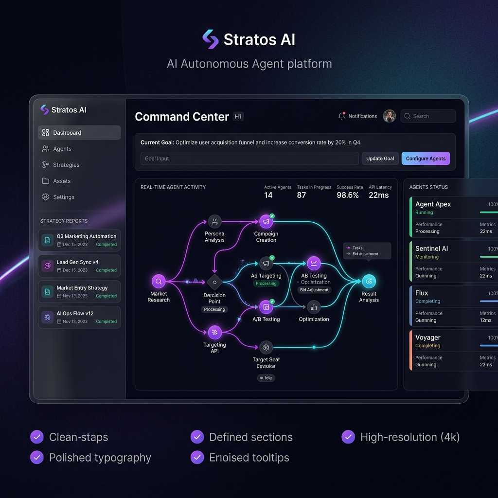

<p align="center">
  
</p>

<h1 align="center">⚡ Stratos AI — Autonomous Agent + RAG Hybrid System</h1>

<p align="center">
  <strong>A production-grade, multi-agent AI platform that autonomously researches, analyzes, strategizes, and executes business plans — powered by Google Gemini 2.5 Flash, LangGraph, and Retrieval-Augmented Generation.</strong>
</p>

<p align="center">
  
  
  
  
  
  
  
</p>

<br/>

<p align="center">
  
</p>

---

## 🧠 What is Stratos AI?

**Stratos AI** is a full-stack autonomous agent system that takes a high-level business goal and autonomously decomposes it into actionable strategies through a pipeline of four specialized AI agents:

| Agent | Role | Output |
|-------|------|--------|
| 🔍 **Researcher** | Retrieves relevant context via RAG engine | Business context & market data |
| 📊 **Analyst** | Extracts patterns, risks, and opportunities using Gemini | 3 critical insights |
| 🎯 **Strategist** | Synthesizes insights into a cohesive strategy | Multi-phase growth plan |
| ⚙️ **Executor** | Generates actionable deliverables | Downloadable execution assets |

Each agent operates as a node in a **LangGraph state machine**, passing enriched state forward through the pipeline — with real-time WebSocket streaming to the frontend.

---

## 🏗️ Architecture

```
┌─────────────────────────────────────────────────────────────┐
│                    STRATOS AI SYSTEM                        │
├─────────────────────┬───────────────────────────────────────┤
│   FRONTEND          │   BACKEND                            │
│   (Next.js 14)      │   (FastAPI + Python)                 │
│                     │                                       │
│   ┌───────────┐     │   ┌──────────────────────────────┐   │
│   │ Command   │◄────┼──►│  REST API + WebSocket Server │   │
│   │ Center UI │     │   └──────────┬───────────────────┘   │
│   └───────────┘     │              │                        │
│                     │   ┌──────────▼───────────────────┐   │
│   ┌───────────┐     │   │     LangGraph Pipeline       │   │
│   │ Results   │     │   │                               │   │
│   │ Dashboard │     │   │  Researcher → Analyst →       │   │
│   └───────────┘     │   │  Strategist → Executor        │   │
│                     │   └──────────┬───────────────────┘   │
│   ┌───────────┐     │              │                        │
│   │ Agent     │     │   ┌──────────▼───────────────────┐   │
│   │ Status    │     │   │  Gemini 2.5 Flash API        │   │
│   │ Panel     │     │   │  + Pinecone RAG Engine       │   │
│   └───────────┘     │   └──────────────────────────────┘   │
└─────────────────────┴───────────────────────────────────────┘
```

---

## ✨ Key Features

- **🤖 4-Agent Autonomous Pipeline** — Research → Analyze → Strategize → Execute, all automated
- **🔄 Real-Time WebSocket Streaming** — Watch agents work in real-time with live log updates
- **🧩 RAG-Augmented Intelligence** — Pinecone vector database for context-aware reasoning (graceful offline fallback)
- **🎯 Structured Mission Briefing** — Define goals, target audience, and constraints for precision output
- **📊 Interactive Node Graph** — Visualize the agent workflow with animated data packets
- **📥 Downloadable Deliverables** — Auto-generated execution assets (plans, drafts, roadmaps)
- **🌙 Premium Dark UI** — Glassmorphism design with animated gradients and micro-interactions
- **🐳 Docker Ready** — Full Docker Compose setup for one-command deployment

---

## 🚀 Quick Start

### Prerequisites

- **Node.js** ≥ 18.x
- **Python** ≥ 3.11
- **Google Gemini API Key** ([Get one free](https://aistudio.google.com/apikey))
- **Pinecone API Key** (optional — system works without it)

### 1. Clone the Repository

```bash
git clone https://github.com/AdityaYad12047/Stratos-AI---Autonomous-Agent-RAG-Hybrid-System.git
cd Stratos-AI---Autonomous-Agent-RAG-Hybrid-System
```

### 2. Configure Environment Variables

```bash
cp .env.example .env
```

Edit `.env` and add your API keys:

```env
GEMINI_API_KEY=your_gemini_api_key_here
PINECONE_API_KEY=your_pinecone_key    # Optional
NEXT_PUBLIC_API_URL=http://localhost:8000
```

### 3. Start the Backend

```bash
cd backend
python -m venv venv
venv\Scripts\activate        # Windows
# source venv/bin/activate   # macOS/Linux
pip install -r requirements.txt
uvicorn main:app --host 0.0.0.0 --port 8000 --reload
```

### 4. Start the Frontend

```bash
cd frontend
npm install
npm run dev
```

Open **http://localhost:3000** — you're live! 🎉

---

## 🐳 Docker Deployment

Spin up the entire system with one command:

```bash
docker-compose up --build
```

| Service | URL |
|---------|-----|
| Frontend | http://localhost:3000 |
| Backend API | http://localhost:8000 |
| API Docs (Swagger) | http://localhost:8000/docs |

---

## ☁️ Cloud Deployment

### Frontend → Netlify

```bash
cd frontend
npm run build
# Drag-and-drop the 'out/' folder to app.netlify.com/drop
```

Set env var on Netlify:
| Key | Value |
|-----|-------|
| `NEXT_PUBLIC_API_URL` | Your backend URL |

### Backend → Render.com

1. Connect this repo on [render.com](https://render.com)
2. Set root directory to `backend`
3. Build: `pip install -r requirements.txt`
4. Start: `uvicorn main:app --host 0.0.0.0 --port $PORT`
5. Add `GEMINI_API_KEY` in Render's environment variables

---

## 📁 Project Structure

```
Stratos-AI/
├── backend/
│   ├── main.py                 # FastAPI server + WebSocket endpoints
│   ├── requirements.txt        # Python dependencies
│   ├── Dockerfile              # Backend container config
│   ├── render.yaml             # Render.com deployment blueprint
│   └── src/
│       ├── agents/
│       │   ├── nodes.py        # 4 agent node implementations (Gemini-powered)
│       │   ├── state.py        # TypedDict state schema for LangGraph
│       │   └── graph.py        # LangGraph state machine definition
│       └── rag/
│           └── engine.py       # Pinecone RAG engine with offline fallback
│
├── frontend/
│   ├── app/
│   │   ├── page.tsx            # Main Command Center dashboard
│   │   ├── layout.tsx          # Root layout with metadata
│   │   └── globals.css         # Global styles + animations
│   ├── next.config.mjs         # Next.js config (static export for Netlify)
│   ├── netlify.toml            # Netlify deployment config
│   ├── tailwind.config.ts      # Tailwind CSS configuration
│   └── package.json            # Frontend dependencies
│
├── docker-compose.yml          # Full-stack Docker orchestration
├── .env.example                # Environment variable template
├── .gitignore                  # Git ignore rules (protects API keys)
├── start_system.bat            # Windows quick-start script
└── system_specification.md     # Technical specification document
```

---

## 🔌 API Reference

### REST Endpoints

| Method | Endpoint | Description |
|--------|----------|-------------|
| `GET` | `/` | Health check |
| `POST` | `/api/v1/stratagem/create` | Launch a new agent workflow |
| `GET` | `/api/v1/stratagem/{job_id}` | Get workflow results |

### WebSocket

| Endpoint | Description |
|----------|-------------|
| `ws://host/ws/v1/stratagem/{job_id}/logs` | Real-time agent log stream |

### Request Body — Create Stratagem

```json
{
  "goal": "Optimize user acquisition funnel",
  "audience": "B2B SaaS Founders",
  "constraints": "Zero budget, 2-week timeline",
  "user_id": "user_123",
  "context_files": []
}
```

---

## 🛠️ Tech Stack

| Layer | Technology |
|-------|------------|
| **Frontend** | Next.js 14, React 18, TypeScript, Tailwind CSS, Framer Motion |
| **Backend** | FastAPI, Uvicorn, Python 3.11 |
| **AI Engine** | Google Gemini 2.5 Flash |
| **Agent Framework** | LangGraph (State Machine) |
| **Vector Database** | Pinecone (Serverless) |
| **Real-Time** | WebSockets |
| **Containerization** | Docker, Docker Compose |
| **Deployment** | Netlify (frontend), Render.com (backend) |

---

## 🗺️ Roadmap

- [x] Multi-agent pipeline with LangGraph
- [x] Real-time WebSocket streaming
- [x] Gemini 2.5 Flash integration
- [x] RAG engine with Pinecone
- [x] Interactive node graph visualization
- [x] Cloud deployment config (Netlify + Render)
- [ ] Redis-backed persistent job storage
- [ ] Multi-user authentication
- [ ] Custom document ingestion for RAG
- [ ] Agent memory & conversation history
- [ ] Webhook integrations (Slack, Email)

---

## 📄 License

This project is licensed under the **MIT License** — see the [LICENSE](LICENSE) file for details.

---

## 👤 Author

**Aditya Yadav**

[](https://github.com/AdityaYad12047)

---

<p align="center">
  <sub>Built with ⚡ by Aditya Yadav — Powered by Google Gemini & LangGraph</sub>
</p>
