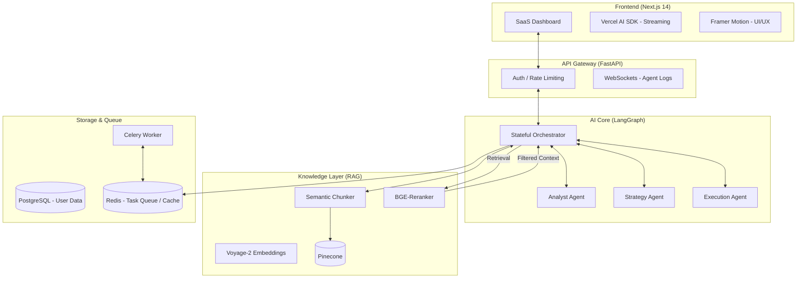

# Stratos AI: Production-Grade System Specification

Stratos AI is a SaaS-first Multi-Agent + RAG Hybrid System designed to automate complex business strategy and execution.

---

## 1. System Architecture Diagram



### Architectural Rationale
- **LangGraph**: Unlike DAG-based chains, LangGraph allows for **cyclic** agent behavior, enabling agents to "review" and "refine" their work recursively.
- **Voyage AI + Reranking**: Standard RAG often misses nuances. Using specialized embeddings and a reranking step ensures the Context-to-Window ratio is optimized for business logic.

---

## 2. Folder Structure

```text
stratos-ai/
├── apps/
│   ├── frontend/             # Next.js 14 (App Router)
│   │   ├── src/
│   │   │   ├── components/   # Dashboard, AgentVisualizer, ReportView
│   │   │   ├── hooks/        # useAgentStream, useRAG
│   │   │   ├── lib/          # Framer-motion variants, utils
│   │   │   └── app/          # Routes (dashboard, settings, results)
│   ├── backend/              # FastAPI
│   │   ├── src/
│   │   │   ├── agents/       # LangGraph definitions & agent logic
│   │   │   ├── rag/          # Chunking, indexing, and retrieval logic
│   │   │   ├── api/          # Endpoints, WebSocket handlers
│   │   │   ├── core/         # Config, security, database sessions
│   │   │   └── main.py       # Entry point
├── packages/
│   ├── types/                # Shared TypeScript/Pydantic models
│   ├── config/               # Shared eslint, tailwind configs
├── docker/                   # Dockerfiles & Compose
├── scripts/                  # Migration & seeding scripts
└── pyproject.toml / package.json
```

---

## 3. Tech Stack Justification

| Layer | Technology | Rationale |
| :--- | :--- | :--- |
| **Frontend** | Next.js 14 | SSR for SEO-friendly landing pages; Client Components for complex dashboard states. |
| **Backend** | FastAPI | High-performance async capabilities; native Pydantic integration for AI data validation. |
| **Agent Framework** | LangGraph | State-machine based orchestration; superior for complex loops and human-in-the-loop steps. |
| **Vector DB** | Pinecone | Managed serverless scaling; multi-tenancy support via namespaces. |
| **Embeddings** | Voyage AI | Consistently outperforms OpenAI on retrieval benchmarks for technical/business data. |
| **Styling** | Tailwind + Shadcn | Rapid development of premium, Stripe-like UI components. |

---

## 4. Data Flow (Step-by-Step)

1. **Ingestion**: User uploads a PDF. Backend triggers an async task to chunk (semantic chunking) and index the data into Pinecone under the `user_id` namespace.
2. **Goal Input**: User enters: *"Expand my SaaS to the Japanese market."*
3. **Retrieval**: Orchestrator queries Pinecone for relevant market research and internal documents.
4. **Analyst Phase**: Analyst Agent extracts specific risks/opportunities from the retrieved context.
5. **Strategy Phase**: Strategy Agent applies a "Growth Matrix" framework to the insights.
6. **Execution Phase**: Execution Agent generates a Notion-ready checklist and an email draft for local partners.
7. **Streaming**: Every thought/action of the agents is streamed via WebSockets to the frontend `AgentActivity` component.

---

## 5. Agent Workflow Breakdown

The system uses a **Stateful State Machine**:

- **Node: `researcher`**: Fetches data and updates the `research_notes` in the global state.
- **Node: `analyst`**: Reads `research_notes`, looks for contradictions, and updates `insights`.
- **Node: `strategist`**: Consumes `insights`, selects a framework (e.g., Ansoff Matrix), and updates `plan`.
- **Conditional Edge**: If the `strategist` determines more data is needed, it loops back to the `researcher`.
- **Node: `executor`**: Finalizes the `plan` into JSON artifacts (emails, checklists).

---

## 6. UI Wireframe Descriptions

### A. The Command Center (Dashboard)
- **Top Bar**: Global search, workspace switcher, user profile.
- **Main View**: A central text area with "Goal" input and "Knowledge Source" toggles.
- **Sidebar**: History of previous "Stratagems".

### B. Agent Pulse (Real-time Execution)
- A visual flow-chart using **React Flow** that lights up nodes as agents process data.
- **Live Logs**: A terminal-style side-drawer showing "Agent Analyst: Extracting competitor pricing..."

### C. The Artifact Viewer (Results)
- A Notion-like document view with interactive charts (Recharts) for market size.
- Actionable buttons: "Sync to Notion", "Send via Email", "Export PDF".

---

## 7. Key API Endpoints

| Method | Endpoint | Description |
| :--- | :--- | :--- |
| `POST` | `/api/v1/ingest` | Upload documents for RAG. |
| `POST` | `/api/v1/stratagem/create` | Start an autonomous agent run. |
| `GET` | `/api/v1/stratagem/{id}` | Fetch final report and action plan. |
| `WS` | `/ws/v1/stratagem/{id}/logs` | Stream real-time agent "thoughts" and status updates. |

---

## 8. Sample Input/Output

### **Input**
**Goal**: *"Generate a Q3 marketing strategy for our B2B CRM SaaS, focusing on LinkedIn outreach."*
**Context**: `company_pitch.pdf`, `competitor_analysis.csv`.

### **Output (JSON Artifact)**
```json
{
  "executive_summary": "High-priority focus on mid-market CFOs using account-based marketing...",
  "insights": [
    {"type": "opportunity", "description": "Competitor X lacks integration with Slack, which our CRM has."},
    {"type": "risk", "description": "LinkedIn CPC is up 12% in the target segment."}
  ],
  "action_plan": [
    {"step": 1, "task": "Draft 5 LinkedIn ad variations", "priority": "High", "impact": "4/5"},
    {"step": 2, "task": "Configure automated outreach in Salesloft", "priority": "Med", "impact": "3/5"}
  ],
  "automation_drafts": {
    "email": "Subject: Improving your Slack-to-CRM workflow...",
    "linkedin_post": "Tired of manual entry? See how [Company] integrates with your daily tools."
  }
}
```

---

## 9. Deployment Strategy

- **Infrastructure**: AWS EKS (Kubernetes) for the FastAPI workers.
- **CI/CD**: GitHub Actions building Docker images to ECR.
- **Environment Management**: Terraform for VPC, RDS (Postgres), and ElastiCache (Redis).
- **Security**: Auth0 for enterprise-grade authentication; Pinecone Namespaces for strict data isolation.
- **Latency**: Global CDN (Vercel) for the frontend; Regional clusters for the backend to reduce LLM API latency.

---

## 10. Future Improvements

1. **Self-Healing Agents**: Implement an "Evaluator Agent" that checks for hallucinations and restarts the node if logic fails.
2. **Multi-Modal RAG**: Support for extracting data from video meetings (Zoom transcripts) and marketing images.
3. **External Tool Execution**: Integration with Zapier/Make.com for 5000+ app automations.
4. **Agent Collaboration**: Allow users to "chat" with specific agents mid-process to course-correct logic.
